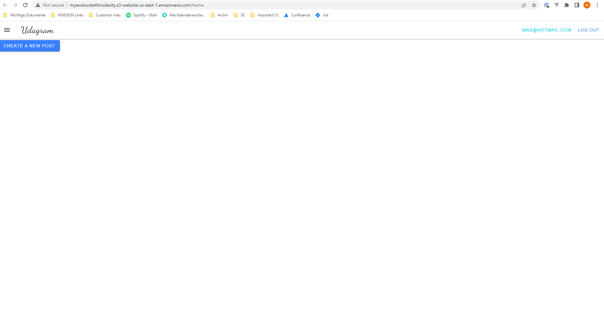
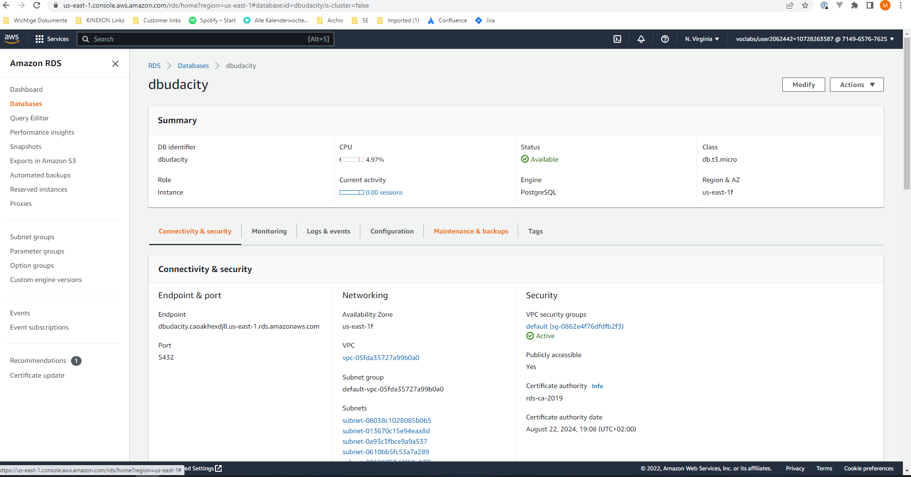
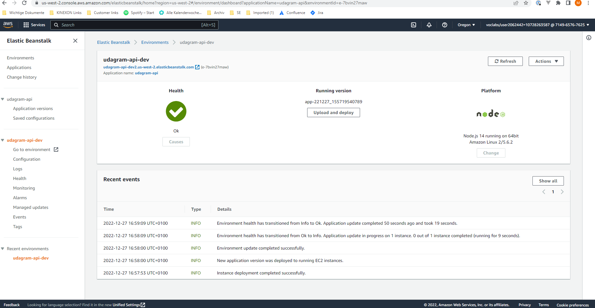
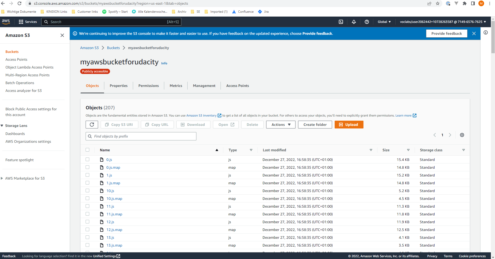
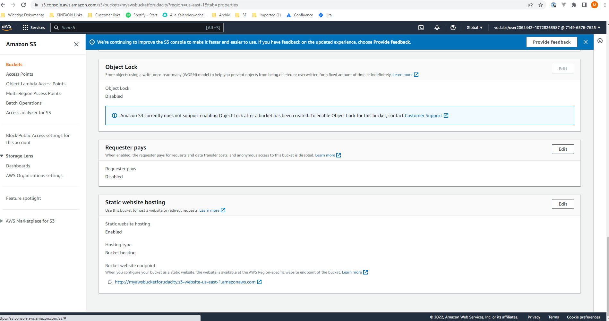

# Hosting a Full-Stack Application

### This is the Udacity project "Hosting a Full-Stack Application" for the course "Full-Stack Javascript developer"

Starter code cloned from: https://github.com/udacity/nd0067-c4-deployment-process-project-starter

Please find the following descriptions in the /docs folder:
- Description of application dependencies
- Used infrastructure incl. diagram
- Pipeline description incl. diagram and screenshots of running pipeline

Below you´ll find screenshots of the running application and services in the AWS cloud:

#### Successfully logged in

#### RDS running successfully

#### EB running successfully

#### S3 running successfully

#### S3 configured as static website (http://myawsbucketforudacity.s3-website-us-east-1.amazonaws.com)

## Installation (steps from original README)

Provision the necessary AWS services needed for running the application:

1. In AWS, provision a publicly available RDS database running 
1. In AWS, provision a s3 bucket for hosting the uploaded files. 
1. Export the ENV variables needed or use a package like [dotnev](https://www.npmjs.com/package/dotenv)/.
1. From the root of the repo, navigate udagram-api folder `cd starter/udagram-api` to install the node_modules `npm install`. After installation is done start the api in dev mode with `npm run dev`.
1. Without closing the terminal in step 1, navigate to the udagram-frontend `cd starter/udagram-frontend` to intall the node_modules `npm install`. After installation is done start the api in dev mode with `npm run start`.

## Testing

This project just contains tests for the frontend. Run the following command in the root folder:

1. `npm run frontend:test`
2. `npm run frontend:e2e`
