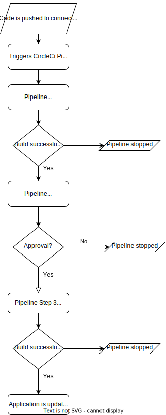
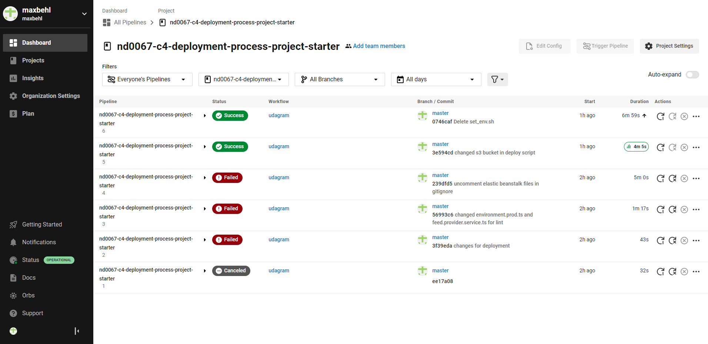
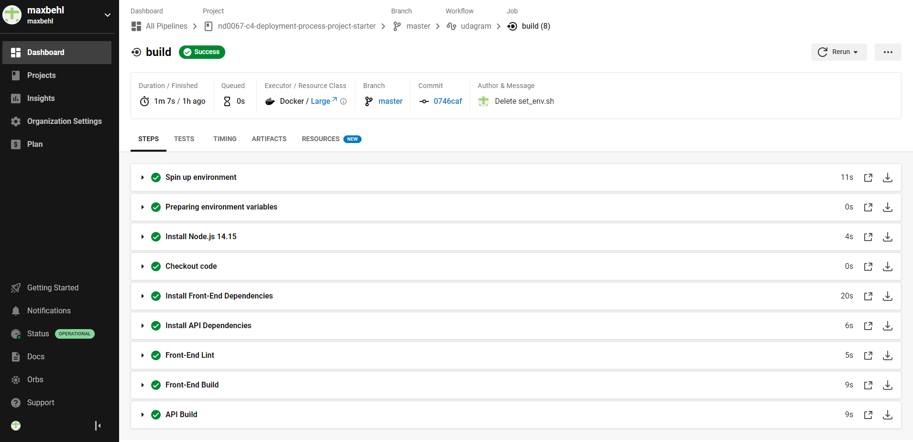
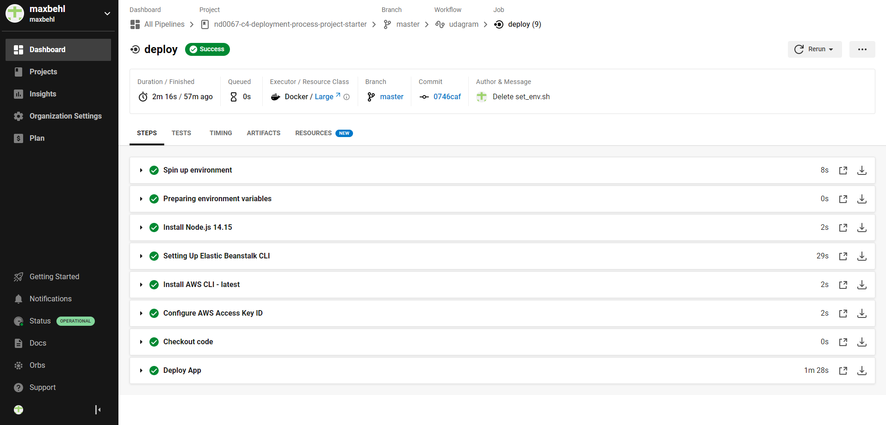

# Pipeline documentation

## Pipeline steps

### Build

In the build phase CicrleCi spins up an environment with Node.js, checks out the Code in GitHub, installs all front-/backend dependencies, lints the frontend code and builds the front-/backend.

### Hold

The Hold steps is just needed because a approval was added to the pipeline. After a manual approval was given the next step starts.

### Deploy

In the last step the application is deployed on the given infratstructure. In our case it´s deployed to the AWS S3 Bucket and the AWS EB Environment.

## Diagram

## Screenshots
In this section you can see screenshots of the successfull pipeline and each step (expect hold as there is no detail page).
### Overview
Showing the successfull that CircleCI is setup up and connected to my personal GitHub repo containing the source code.

### Build
Showing the detail view of the successfull Build step.

### Deployment
Showing the detail view of the successfull Deployment step.

